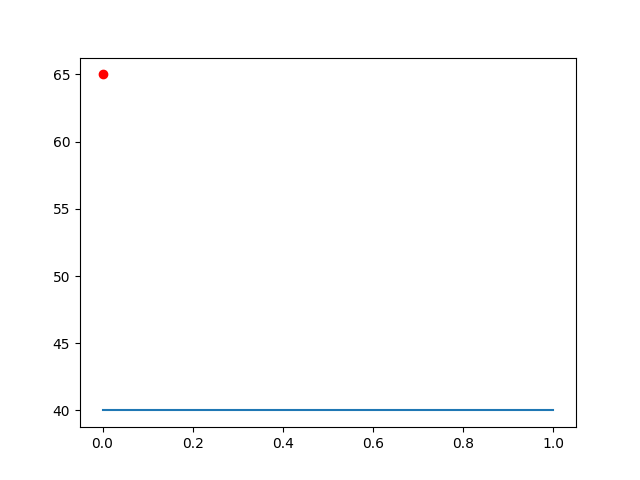

## General

Templates can be written in any markup language. Markdown is a common choice.

Template tags use Jinja2 syntax. Here is Jinja's [template designer documentation](https://jinja.palletsprojects.com/en/2.11.x/templates/) page.

## Environment

Precipy populates the jinja environment with information from analytics functions, and about the batch as a whole.

### Constants

If there are any constants defined in the config, they are accessible via the `constants` dictionary or directly in the top level namespace.

<table>

<tr style="background-color: white;"><th>RANDOM_FILENAME</th><td>random_0_100.npy</td></tr>

<tr style="background-color: lightgray;"><th>PLOT_FILENAME</th><td>plot_with_overlay.png</td></tr>

</table>

### Functions

The `functions` top-level object contains a dictionary of AnalyticsFunctions objects, keyed by function key.

For this demo, the analytics functions are:

- write_data_file_without_object
- read_data_file_without_object
- generate_data
- generate_data_1000
- plot_values

Each of these function keys can also be used directly. Let's look at the attributes/methods available for one of these function objects in detail.

#### plot_values

`function_name` attribute:
plot_values

`function_elapsed_seconds` attribute:
The function took 0.8844730854034424 seconds to run.

`function_source` attribute, with `highlight` filter applied:
<pre>

<pre style="line-height: 125%">def plot_values(af, c, n):
    print(af.path_to_cached_file(RANDOM_FILENAME, &quot;generate_data&quot;))
    for f in af.read_file(RANDOM_FILENAME, &quot;generate_data&quot;, mode=&quot;rb&quot;):
        ary = np.load(f)
    plt.plot(ary, &#39;ro&#39;)
    plt.plot([0, n], [c, c])
    plt.savefig(PLOT_FILENAME)
    af.add_existing_file(PLOT_FILENAME, remove=True)
</pre>

</pre>

`function_output` attribute:
The function returned output: `None`

The `kwargs` attribute contains function arguments in a dictionary:

- c: 40
- n: 1

The `files` attribute contains all files associated with this function in a dictionary. Usually these are the files generated as side effects from running the function:

- metadata.pkl 
- plot_with_overlay.png 

### Files

Let's look at the attributes available for a `files` instance.

Canonical Filename: plot_with_overlay.png

Cache Filepath: /var/folders/wb/1y3rpg4n7798b3nxxlj6vdy80000gn/T/precipy/precipy_demo_cache/41/410d6a172d15167cf6d08652f324a8d4794eb36c30027e3d35122b13e34b190a.png

Public URLs: ['https://storage.googleapis.com/precipy_demo_cache/410d6a172d15167cf6d08652f324a8d4794eb36c30027e3d35122b13e34b190a.png']

Depending on the use case, you may wish to link to assets in the output directory (which will be the same directory where documentation will end up. Or the cache filepath, which will be a fully qualified path on the same file system. Or one of the Public URLs which show where the item has been uploaded to cloud storage. (Bucket must be sent to public/anonymous access.)

Here are examples of img tages using each of these three.

</img>
</img>
</img>

